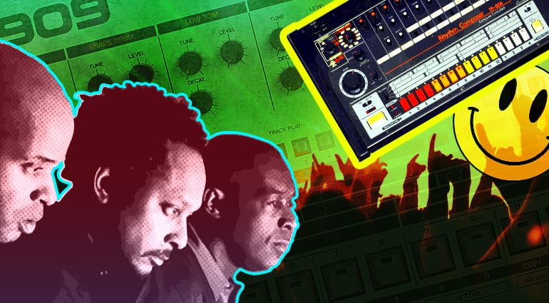
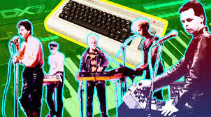

# A music blog for electronic music lovers

## Modern people can not imagine their daily life without music, the blessing that in order to listen to your favorite tunes in any situation of life is created and offered a huge number of special devices.In addition to music players are invited to listen to music with your cell phone equipped with headphones, you can listen to the radio via the Internet or download your favorite music tracks on an external data carrier, that is, a flash drive.
Modern people can not imagine their daily life without music, the good news is that in order to listen to your favorite tunes in any situation created and offered a huge number of special devices.

In addition to music players are invited to listen to music with your cell phone equipped with headphones, you can listen to the radio via the Internet or download your favorite music tracks on an external storage device, which is a flash drive.

To date, there are a huge number of musical directions, among which young people are especially electronic music.

Electronic music is distinguished by its activity, the brightness of a variety of sounds, the ability to dance to it without feeling uncomfortable and so on.

If you can call yourself an avid listener of modern music, including electronic music, the music blog will allow you at any time of the day to learn news about famous artists, as well as to arrange to listen to new music tracks immediately after their premiere.

The information on the music blog is always fresh, so the potential music lover will always be aware of all the news about many stars, including those who play electronic music.

All of the information on this music site is offered to everyone interested for free, which is important for everyone these days.

Your attention will be presented with new music records, an overview of the best music, new tracks and a lot of beautiful and unique electronic music.

You can visit the site at any time of day, which is an important factor for all people with an active lifestyle.

The music blog contains many sections, so every music lover can find interesting information and interesting musical works of different artists.

I would like to note that electronic music is gaining more and more love and popularity from year to year among modern people and even among people of older age.

This is due to the fact that the performers and creators of the tracks of electronic music bring a lot of new sounds to their works, which allows you to create a unique and quite harmonious melodies.

If you previously were not fond of electronic music, then going to the music blog site, you can listen to the best tracks, which will allow you to define your attitude to this direction of music. 

